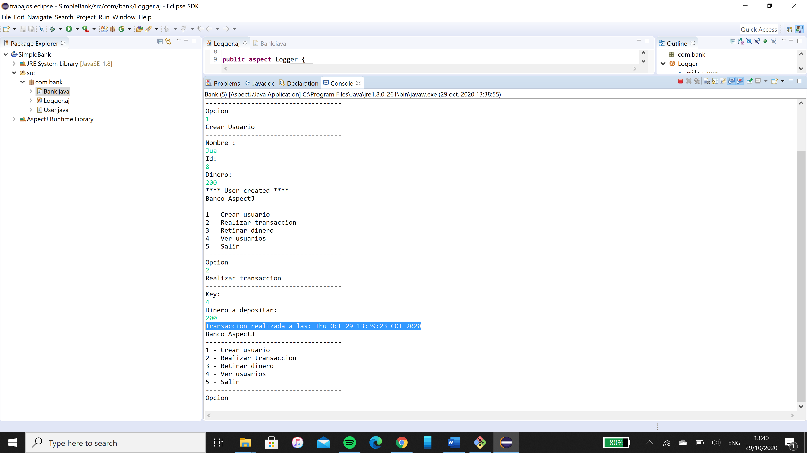
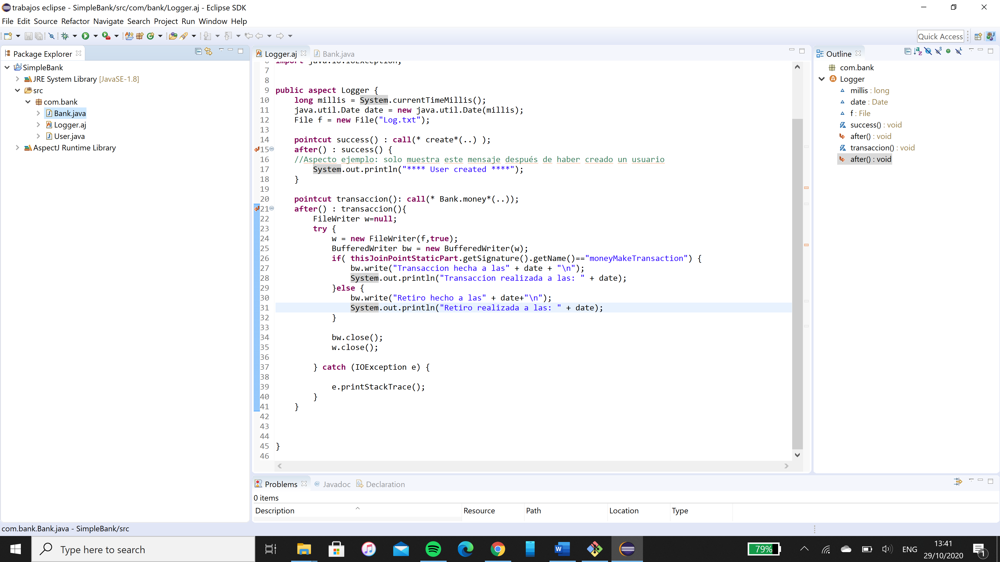

# Taller02-AspectJ
taller 02 usando eclipse y aspect

# Funcionamiento de AspectJ

    

Captura del funcionamiento del Aspecto de las transacciones

# Código de AspectJ

    

Captura del Aspect Logger
